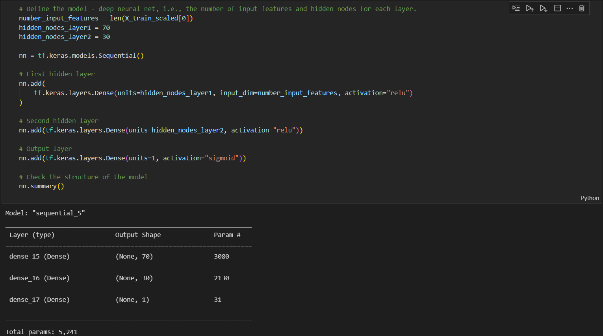
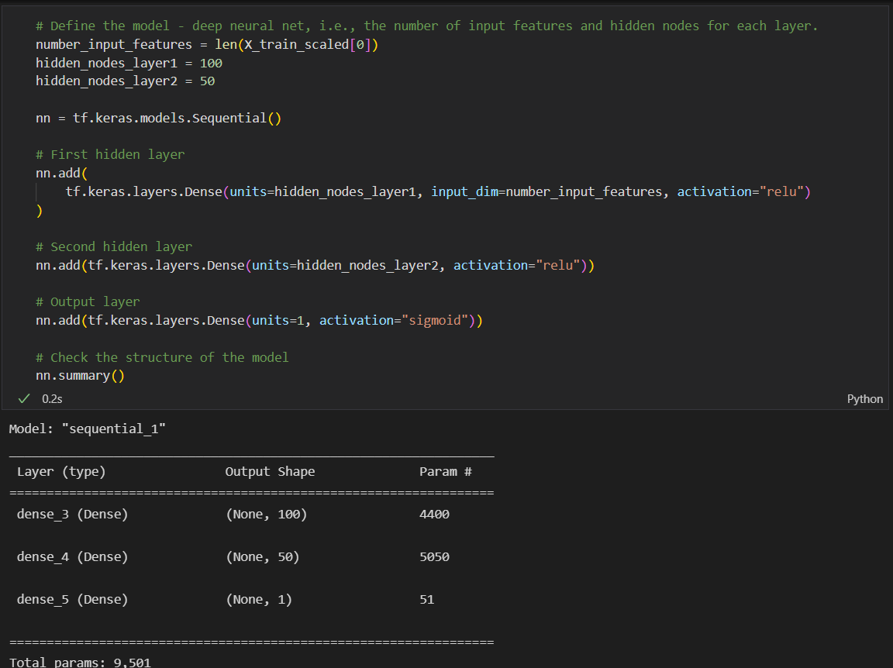
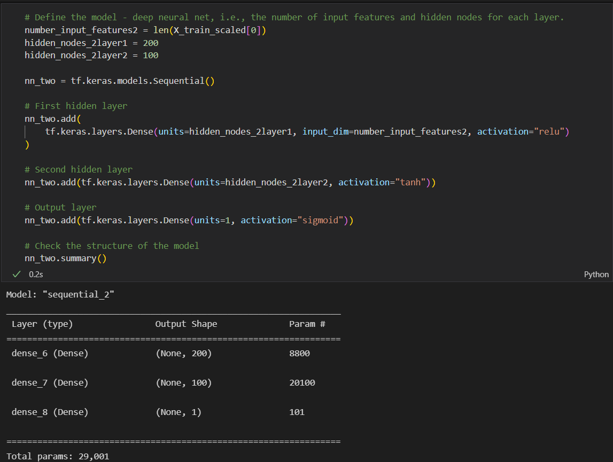
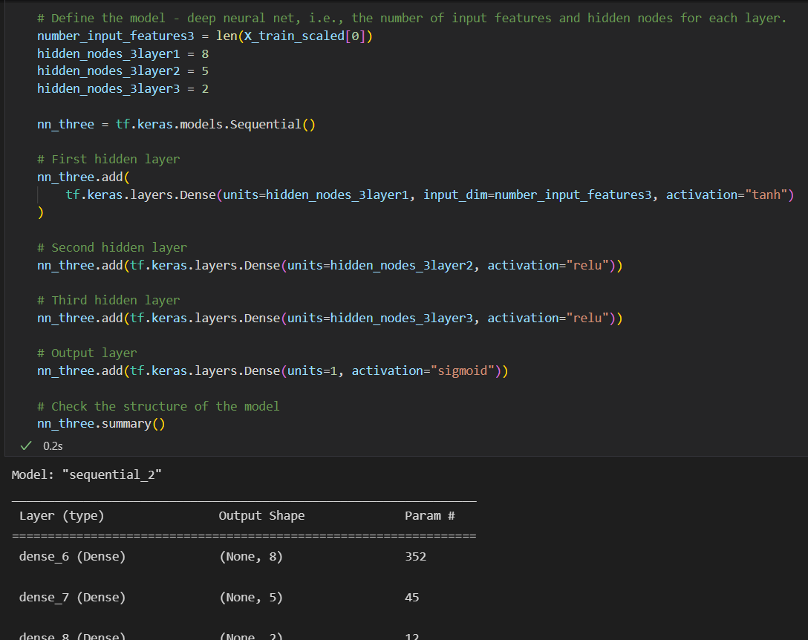
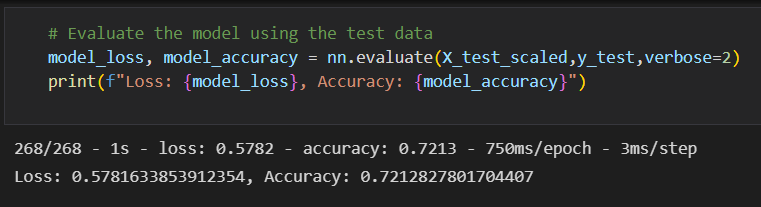
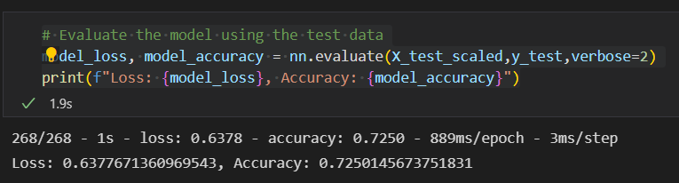
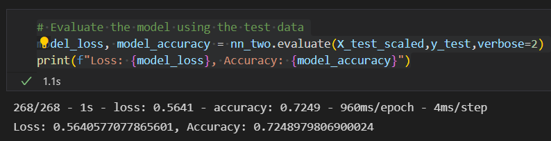
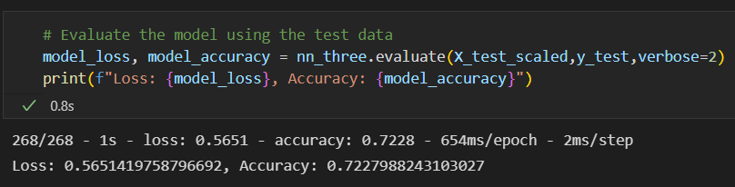

# Neural Network Charity Analysis

## Overview

Using features in the provided dataset to help create a binary classifier that is capable of predicting whether applicants will be successful if funded by Alphabet Soup.

## Results

### What variable(s) are considered the target(s) for your model?

The target variable for my model is the 'IS_SUCCESSFUL' column.

### What variable(s) are considered to be the features for your model?

After cleaning the data and merging DataFrames, all columns except the 'IS_SUCCESSFUL' column are the features.

### What variable(s) are neither targets nor features, and should be removed from the input data?

The variables removed from the input data was the 'APPLICATION_TYPE', 'AFFILIATION', 'CLASSIFICATION', 'USE_CASE', 'ORGANIZATION', 'INCOME_AMT', and 'SPECIAL_CONSIDERATIONS' columns.

### Compiling, Training, and Evaluating the Model

#### How many neurons, layers, and activation functions did you select for your neural network model, and why?

-As seen in the image below, I used 70 neurons for the first layer and 30 for the second layer. I used two different activation functions in relu for both the first and second layers and for the output layer I used the sigmoid function because I thought that would work best. See below:

#### Were you able to achieve the target model performance?

-I was not able to achieve the target model performance of 75 percent accuracy.

#### What steps did you take to try and increase model performance?

-To increase model performance, I first tried increasing the number of neurons to 100 in the first hidden layer and 50 in the second hidden layer and keeping the same activation functions. See below:

-The second attempt at increasing model performance I tried to increase the number of neurons again to 200 in the first and 100 in the second layer and also changing the second layer's activation function to tanh, while keeping the first and output layers the same as the starting neural net. See below:

-The third attempt at increasing model performance I tried decreasing the number of neurons in the first layer to 8, the second layer to 5, and adding a third hidden layer with 3 neurons. I made the first hidden layer's activation function tanh, with the second and third hidden layers relu with the output layer sigmoid.

## Summary

Summarize the overall results of the deep learning model. Include a recommendation for how a different model could solve this classification problem, and explain your recommendation.

Overall, the target accuracy of 75 percent was never reached with any of the neural networks I set up, as seen in the results below. Perhaps using the ensemble classifier instead of a neural network model would gain a better accuracy as there are many factors that can be changed to improve neural networks, but oftentimes changes made only make the neural network less accurate whereas with the ensemble classifier, there's only a few factors to change and the accuracy is usually high.

### Starter Results

### NN Test 1 Results

### NN Test 2 Results

### NN Test 3 Results

## Resources
- Software: [Python](https://www.python.org/), [Visual Studio Code](https://code.visualstudio.com/), 1.65.2, Jupyter Notebook
